# NourishAI Performance Report

NourishAI, an AI-powered smart nutrition brand revolutionizing the FMCG industry.NourishAI offers customized meal solutions using AI-driven recommendations and adaptive formulations based on consumer health data, preferences, and market trends.

This report provides a deep insight into user demographics, satisfaction trends, subscription behavior, sales performance, snack preferences, and brand recall.

## Table of Contents

- Overview
- Insights  
  - Customer Satisfaction  
    - Age Distribution  
    - Most Satisfied Customers  
    - Correlation between Subscription Period and Satisfaction Score  
    - Feedbacks  
  - Sales Analysis  
    - Sales Comparison  
    - Monthly Growth Rates and Sales Forecast  
  - Snack Preferences  
    - Purchase Frequency of Each Age Group  
    - Health Preference of Each Age Group  
    - Snack Perception  
    - Brands Purchased Frequently  
    - Brand Recall by Health Preference  
    - Brand Recall Distribution Across Income Levels  
- Takeaway
- Recommendations

## Overview

The majority of users are aged 20-35, peaking at 30 years old, with engagement declining from 40+. Satisfaction trends align with age distribution, showing strong appeal among younger users. Subscription duration averages 6.6 - 7.1 months, regardless of satisfaction scores, indicating external factors influence retention. Sales have grown consistently, with August (+12.9%), June (+12.5%), and March (+11.73%) seeing the highest growth, while December & November had the highest sales. Forecasts predict sales exceeding 1,400+ units/month in early Year 3, with July (~1,045 units) remaining the weakest. Most users prefer monthly snack purchases (~55-60 per group) over daily ones. The 25-34 age group favors gluten-free (19.6%), high-protein (19.6%), and low-calorie (21.2%) snacks, while 35-44 prefers organic (21.2%) and vegan (22.4%) options. NourishAI dominates the market (375 purchases), outperforming Competitor A (196), B (155), and C (152), leading in health-conscious segments and brand recall across all income levels.

## Insights

### Customer Satisfaction

#### Age Distribution

- The histogram shows a high concentration of users between ages 20-35, peaking around 30 years old. This suggests that the primary user base is **young adults.** 
- The number of users declines steadily from 40 onwards, with smaller peaks around 50 and 60 years old. This indicates that **older adults (50+) are less engaged** with the service. 

#### Most Satisfied Customers
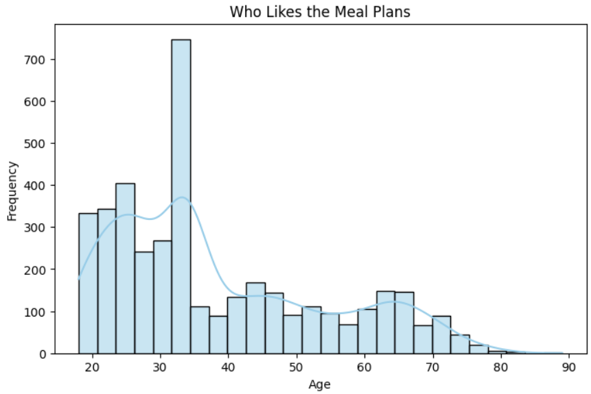
- There is a strong concentration of satisfied users aged between 20-35, with a peak at 30 years old. The trend is similar to the general age distribution, suggesting that **most users who try the service belong to this age group. **
- There is no major increase in satisfaction among older users, meaning meal plans are **not exceptionally popular among seniors. **

#### Correlation Between Subscription Period and Satisfaction Score
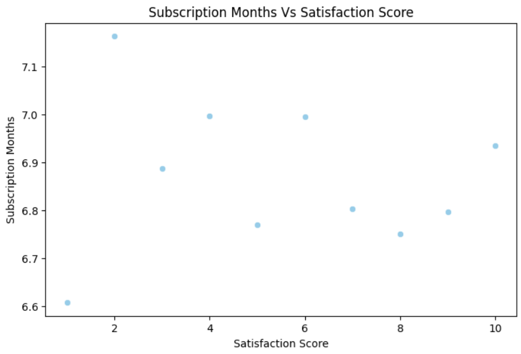
- If satisfaction had a direct impact on subscription duration, we would expect higher satisfaction scores to correlate with longer subscriptions. However, here we see that even dissatisfied users (low scores) have similar subscription lengths as highly satisfied users (scores 9-10). This suggests that **external factors (such as commitment to meal plans, convenience, or lack of alternatives) may be influencing how long users stay subscribed. **
- Since lower satisfaction does not necessarily translate into immediate cancellations, the company might have an opportunity to **increase satisfaction while keeping customers engaged**. Identifying **why lower-satisfaction users remain subscribed** could be a key factor in improving retention.
- The lowest satisfaction scores (1-3) show slightly shorter subscription durations, but not significantly different from other scores. This might indicate that **even the most dissatisfied users don't immediately cancel**, which could be due to factors like prepaid subscriptions or trial periods.
- The length of an average subscription is around 6.6 to 7.1 months across all satisfaction scores. 

#### Feedbacks

    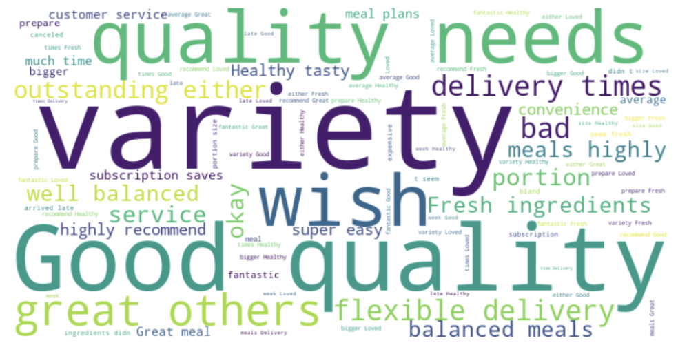
    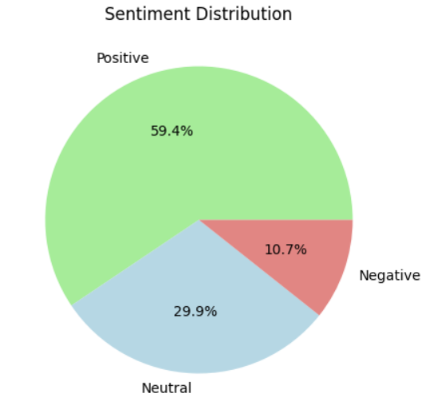

- The majority of feedback is positive, indicating that most customers are satisfied with the meal plans. Customers highly appreciate **variety, quality, and convenience**. The meal plans are perceived as **well-balanced and fresh**, attracting health-conscious consumers. **Customer service and flexibility** are valued aspects of the subscription. 
- A small fraction of customers is dissatisfied, likely due to issues such as **delivery delays, portion sizes, or quality inconsistencies.** Some customers desire **more customization options** for meals.
- **Needs, Wish** are among the top keywords which suggest areas where customers expect improvements.

### Sales Analysis

#### Sales Comparison
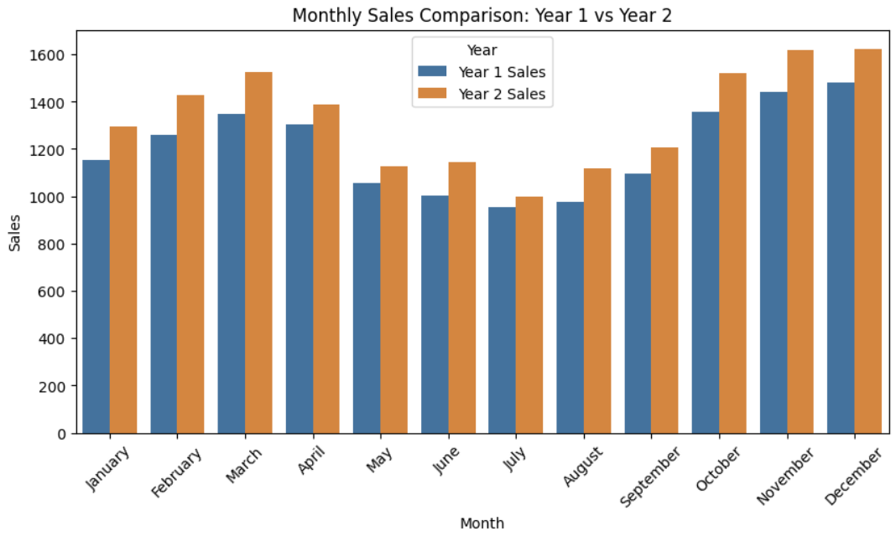
- Sales grew in every month from Year 1 to Year 2, showing a consistent upward trend. **August had the highest growth rate (12.9%)**, followed by **June (12.5%) and March (11.73%)**. **July** had the **lowest growth rate (4.5%)**, indicating a relatively weaker month.
- December had the highest sales in both years followed by November, confirming strong holiday season demand. While July had the lowest sales aligning with a **seasonal slowdown**. 

#### Monthly Growth Rates and Sales Forecast
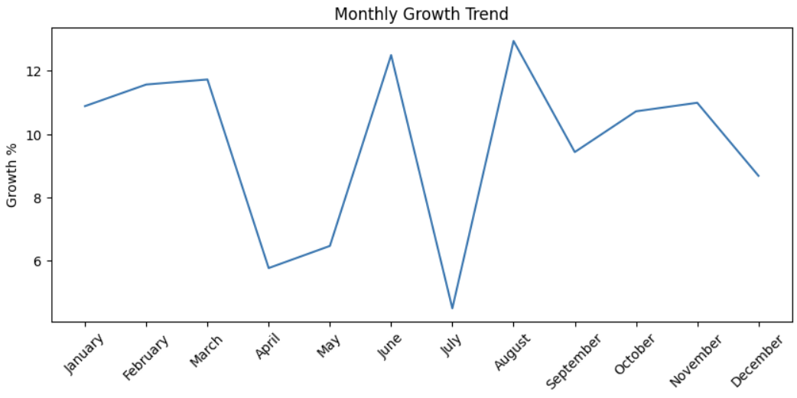
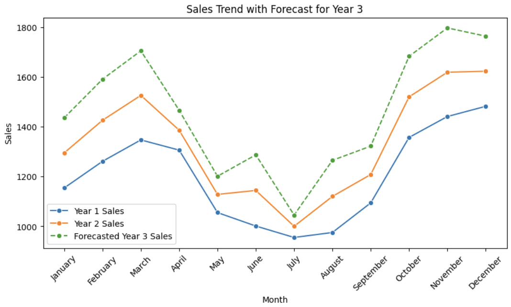
- Growth remained **above 10% for most months**, with notable exceptions in April (5.77%) and July (4.5%).  A sharp decline here could be highlighting **potential weak demand** or **operational inefficiencies**. 
- The highest growth peak was observed in **August (12.94%)**, followed by **June (12.5%)**, suggesting strong mid-year performance. 
- The forecast suggests an **increase in sales in the 3rd year** as seen in the first two years. **January to March show steady growth**, with forecasted sales crossing 1400+ units each month. While July still appears to be a low-performing month (1045 units forecasted sales), in line with historical trends. 

### Snack Preferences

#### Purchase Frequency of Each Age Group

- The highest count of purchases in all age groups is in the Monthly category (~55-60 purchases per group), suggesting that people tend to buy and stock them in bulk instead of buying them frequently.
- Similarly, it can be seen that out of all purchase trends Daily purchase frequency is the lowest indicating that people prefer buying and stocking instead of buying new ones every day.
- The 65+ age group has a notable drop in Weekly & Daily purchases (having less than 30 "Rarely" purchases). Suggesting reduced snack consumption which might be due to health considerations.
- The 35-44 group has ~18-20 daily purchases, slightly higher than other groups. Represents a small 
but loyal segment that could be targeted with convenience-sized or on-the-go snack options.

#### Health Preference of Each Age Group

- The 25-34 age group shows the highest demand for gluten-free (19.6%), high-protein (19.6%), and low-calorie (21.2%) snacks, indicating a strong focus on fitness and healthy eating.
- The 35-44 age group has the highest preference for organic (21.2%) and vegan (22.4%) snacks, making them the primary consumers of plant-based and natural products.
- Older consumers (65+) don’t seem to be much interested in any of the snack varieties, one reason could be their preference in traditional snacks.

#### Snack Perception

    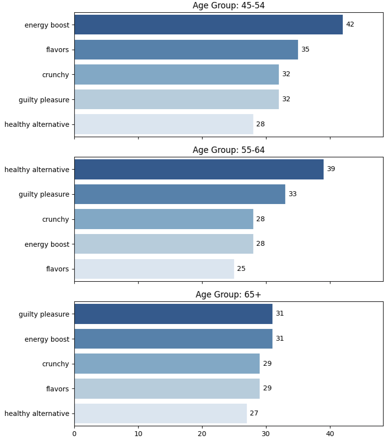
    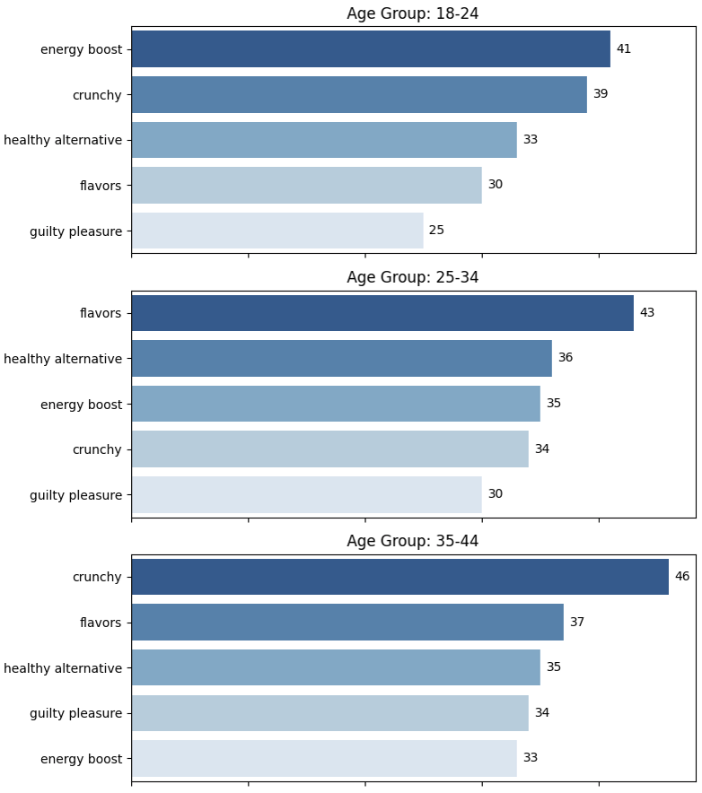

- Young Adults (18-24) Seek Energy & Texture. The top perception for this group is "Energy Boost" (41 responses), followed by "Crunchy" (39 responses). This suggests that younger consumers associate snacks with quick energy and satisfying texture, making functional and crunchy snacks appealing.
- This people in 25-34 age group prioritize "Flavors" (43 responses) more than any other attribute, showing that taste is a key factor. "Healthy Alternative" (36 responses) and "Energy Boost" (35 responses) also rank high, indicating a balance between indulgence and health-conscious choices.
- Middle Age Groups (35-54) show varied preferences, some want their snack to be crunchy while others want them flavourful and energizing.
- 55-64 group leans towards "Healthy Alternative" (39 responses), showing an increasing preference for nutritious snacks. While the 65+ group sees "Guilty Pleasure" (31 responses) and "Energy Boost" (31 responses) as top perceptions, indicating a mix of indulgence and functional snacking.

#### Brands Purchased Frequently
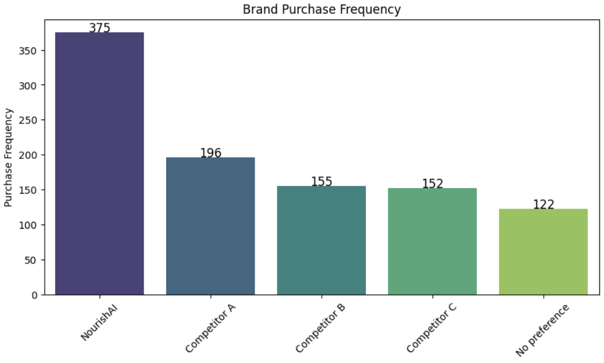

- NourishAI Leads the Market. NourishAI has the highest purchase frequency at 375, significantly ahead of its competitors. This suggests that NourishAI is the most preferred brand among consumers.
- Competitor A has a purchase frequency of 196, which is about 52% lower than NourishAI. While it's the second most preferred brand, it still has a substantial gap compared to NourishAI, indicating room for growth.
- Competitor B (155) and Competitor C (152) are almost at the same level in purchase frequency. Their close numbers suggest they appeal to a similar customer base but lag behind NourishAI and Competitor A.

#### Brand Recall by Health Preference
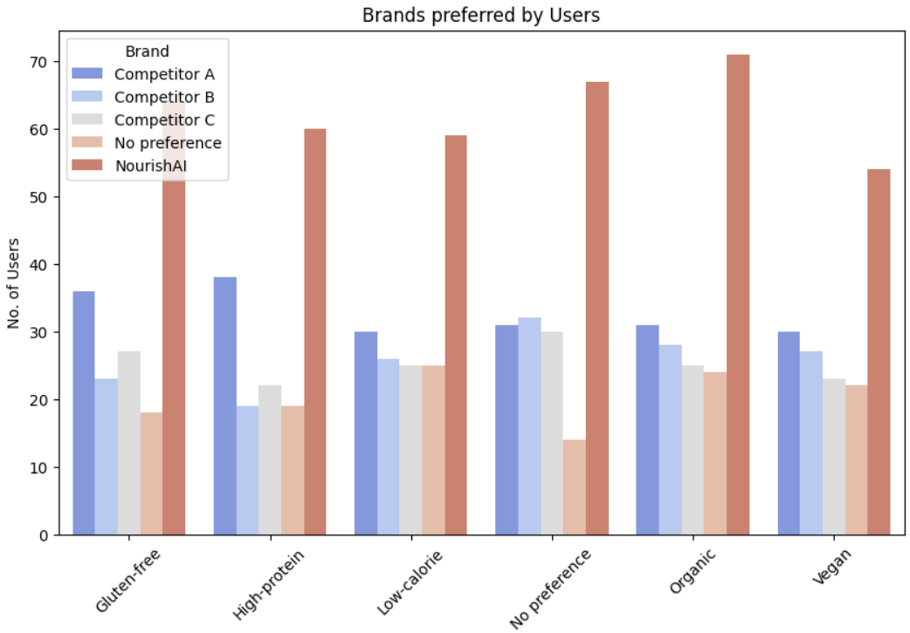
-  NourishAI is the Most Preferred Brand Across All Categories. In every dietary category (Glutenfree, High-protein, Low-calorie, Organic, Vegan), NourishAI leads significantly. Particularly dominant in Organic and High-protein segments, suggesting strong brand trust in health conscious consumers.
- After NourishAI, Competitor A leads the market. Gluten-free (around 38 users) and High-protein (around 40 users) see Competitor A performing well. This suggests that Competitor A has a niche customer base looking for specific health benefits.
- Around 60 users in "No Preference" segment suggest an opportunity for competitors to win over undecided consumers. This segment is crucial for future marketing campaigns, offering a chance to attract new loyal customers.

#### Brand Recall Distribution Across Income Levels
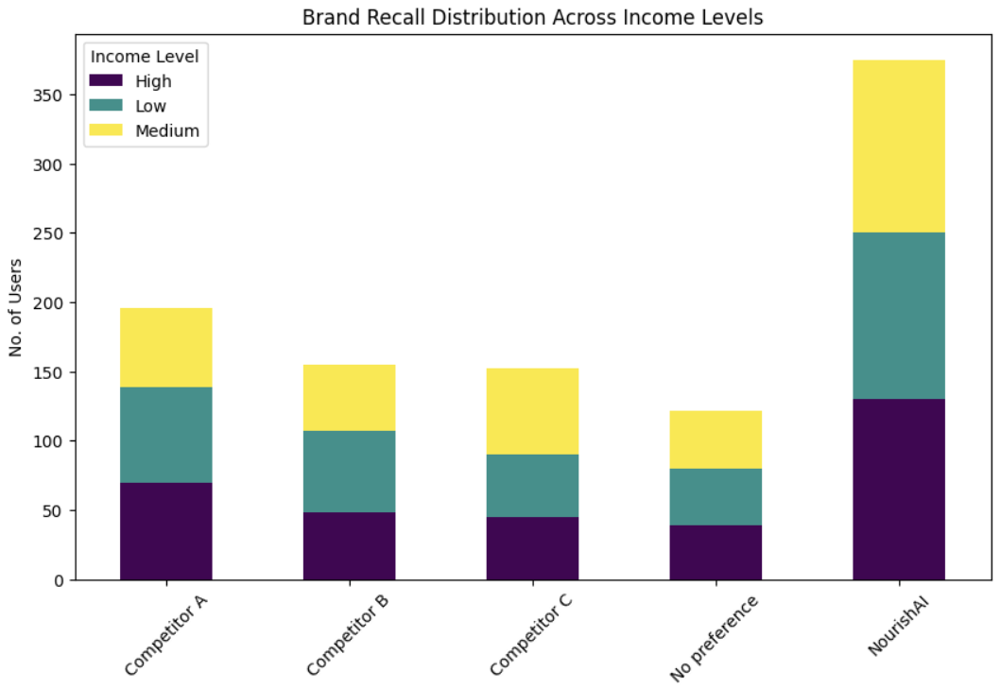
- Compared to competitors (A, B, C), NourishAI has the highest brand recall across all income levels. The total number of users recalling NourishAI is significantly higher than those recalling competitors or having no preference.
- All brands, including "No Preference," have a mix of High, Medium, and Low-income users.NourishAI has a higher recall among High and Low-income users compared to competitors. Competitor brands (A, B, C) have a more balanced recall across income levels but at a lower total volume.
- The number of users with no brand preference is the lowest among all categories. This suggests that most customers have a brand association when it comes to snack choices.

## Takeaway

- **Young Adults (20-35) Are the Core Customer Base:**
  - Age distribution and satisfaction trends show that the majority of users are between 20-35 years old, 
    peaking at 30 years old.
    This group is also the most satisfied, indicating that meal plans and snack offerings align with their 
    needs (convenience, affordability, health focus). Older users (50+) show lower engagement, suggesting a potential gap in offerings for this segment
- **Sales Show Consistent Growth, But July Is a Weak Month:** 
  - Sales increased every month from Year 1 to Year 2, with August (12.9%) and June (12.5%) showing the highest growth. December and November have the highest         sales, confirming strong demand during the holiday season. July is the lowest-performing month, indicating seasonal dips or operational challenges that could 
    be addressed.
- **NourishAI Dominates the Market in Brand Recall & Purchases:**
  - NourishAI leads in brand recall (375 users) and purchases, significantly outperforming Competitor A (196 users). 122 users have no brand preference, showing       potential for competitors to capture market share 
    with better offerings.

## Recommendations

- **Expand Appeal to Older Adults (40+)**. Since engagement drops after 40, introduce meal plans catering to this group with **customized dietary options** (e.g., heart-healthy, low-sodium, diabeticfriendly). Offer **senior discounts** or **loyalty programs** to encourage long-term subscriptions.
- Given that subscriptions last around **6.6 to 7.1 months**, introduce **tiered pricing models** (e.g., lower rates for 12-month plans) to extend customer retention. **Add mid-subscription incentives** (e.g., a free healthy snack after 6 months) to maintain engagement.
- Addressing Negative Feedback Areas like improving **delivery reliability** by optimizing logistics and offering real-time tracking. **Adjust portion sizes** based on customer feedback to better meet expectations. Introduce **more customization options** (e.g., ingredient swaps, portion adjustments, dietary preferences)
- Since **young adults (25-34) prioritize high-protein, gluten-free, and low-calorie snacks**, NourishAI should **expand these snack options.**
- Since **122 users have no brand preference**, there’s an opportunity to capture these undecided customers with targeted marketing campaigns and **introductory trial packs**. Highlight NourishAI’s dominance in health-conscious segments (e.g., high-protein, organic) with **stronger brand storytelling** in ads, influencer collaborations, and social proof (testimonials, ratings).

  
By addressing these opportunities, **NourishAI** can solidify its market leadership, boost customer satisfaction, and drive long-term growth.

---
This report is based on synthetic data generated using the Faker library in Python. The findings and insights presented are for analytical and illustrative purposes only and do not reflect real-world data.
